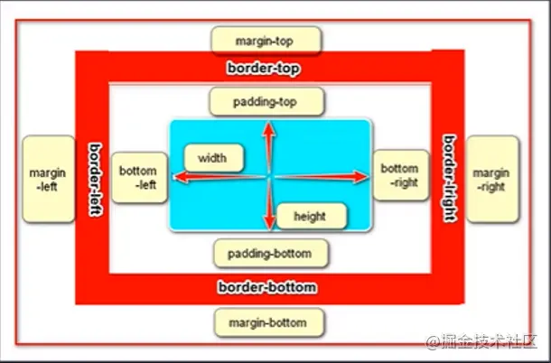

## CSS盒子模型（box-sizing属性）
>所有的HTML元素都可以看做盒子，这个有三层 从外到内依次用：边距（margin）、边框（border）、填充（padding）这三个属性包裹着其中的内容（content）。每个盒子都有自己的大小和位置，同时也影响着其他盒子的大小和位置。  
**margin > border > padding > content**

## 两种盒模型（W3C盒模型，IE盒模型）
> W3C盒模型与IE盒模型的区别就是对宽高的定义不同。
1. W3C认为：宽高是内容区的宽度（只包含节点显示的具体内容）
   1. **box-sizing: content-box 默认值**  
   2. **元素的宽度 = content的宽度**
1. IE认为：宽高是显示效果的实际效果（包含节点的全部内容） 
   1. **box-sizing: bordedr-box**
   2. **元素的宽度 = content + padding + border**

> W3C盒模型也叫标准盒模型
